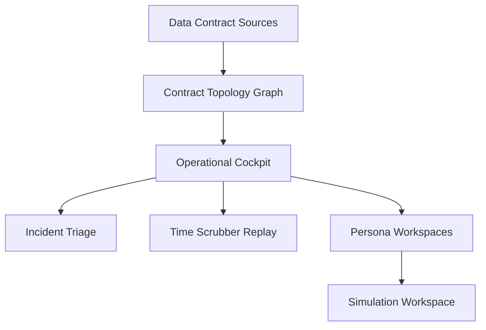
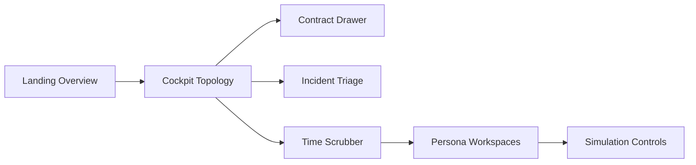

# Signal Mesh

Signal Mesh is an industrial data contract operations platform for OT/IT environments. It presents a high-density operational interface for contract governance, time-aware observability, and simulation workflows across distributed assets.

---

## Overview

Industrial data streams are treated as explicit contracts with defined schema, freshness, quality, lineage, and ownership. Signal Mesh visualizes contract health, monitors violations, and supports simulation-based change management without touching production payloads.

### Problem

OT and IT ecosystems often expose data contracts without consistent enforcement, leading to schema drift, lagging freshness signals, and fragmented operational visibility across plants and enterprise teams.

### Solution

Signal Mesh combines contract-aware topology, time scrubber replay, and incident intelligence with persona-specific workspaces to make contract governance operational and actionable.

### Outcome

- Contract health is visible as a live topology map with incident traceability.
- Teams can replay historical states to isolate when violations began.
- Simulation controls model SLA impact before changes are published.

---

## Enterprise Capabilities

- Contract topology cockpit with live edges, status, and incident cues
- Time scrubber for temporal observability and forensic replay
- Persona workspaces for plant, compliance, and executive roles
- Simulation workspace for SLA and violation forecasting
- Accessible UI with keyboard navigation and reduced motion support
- Hardened production headers on Vercel (CSP, frame, and referrer policies)

---

## Architecture (UI System)



---

## Experience Flow



---

## Tech Stack

- HTML, CSS, vanilla JavaScript
- SVG topology rendering
- JSON-driven UI state
- Vercel static deployment

---

## Project Structure

```
.
├── data/
│   └── mesh.json
├── index.html
├── main.js
├── styles.css
├── vercel.json
└── README.md
```

---

## Run Locally

Open index.html in a browser, or use a local static server.

```powershell
# Optional: serve with a local static server
python -m http.server 5173
```

Then visit http://localhost:5173

---

## Validation and Checks

Suggested checks before production push:

| Check | Purpose |
| --- | --- |
| Lighthouse audit | Verify performance and accessibility scores |
| Keyboard navigation sweep | Validate tab order and focus visibility |
| Responsive pass | Confirm cockpit, drawer, and simulation layouts |
| Console scan | Ensure no runtime warnings or JSON fetch errors |

---

## Quality & Accessibility

- Keyboard-accessible topology nodes and persona tabs
- Focus-visible states and skip link
- Reduced motion compliance for animation-heavy areas
- ARIA dialog metadata for the contract drawer

---

## Deployment

This project is deployed as a static site.

- GitHub repository: https://github.com/PC-User-Guest/Signal-Mesh
- Vercel production: https://signal-mesh-prod.vercel.app

---

## Security Headers

Vercel is configured with production headers in vercel.json:

- Content-Security-Policy
- X-Content-Type-Options
- X-Frame-Options
- Referrer-Policy
- Permissions-Policy

---

## License

All rights reserved. For internal use and evaluation only.
