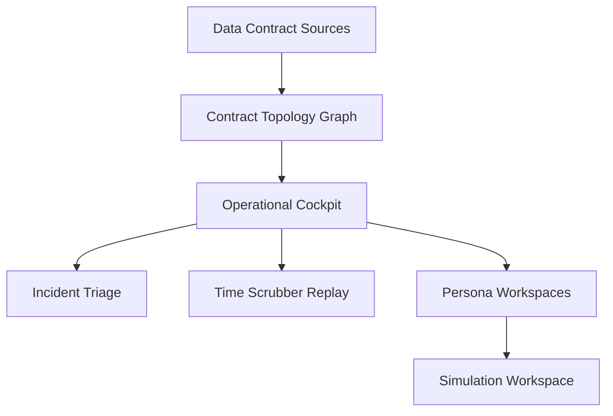

# Signal Mesh

Signal Mesh is an industrial data contract operations platform for OT/IT environments. It presents a high-density operational interface for contract governance, time-aware observability, and simulation workflows across distributed assets.

## Highlights

- Contract-native operational cockpit with topology and incident cues
- Time scrubber for historical state replay
- Persona workspaces for plant, compliance, and executive roles
- Simulation controls for SLA and violation forecasting
- Accessible UI enhancements with keyboard navigation and reduced motion support

## Product Narrative

Industrial data streams are treated as explicit contracts with defined schema, freshness, quality, lineage, and ownership. Signal Mesh visualizes contract health, monitors violations, and supports simulation-based change management without touching production payloads.

## Architecture (UI System)



## Tech Stack

- HTML, CSS, vanilla JavaScript
- SVG topology rendering
- JSON-driven UI state

## Project Structure

```
.
├── data/
│   └── mesh.json
├── index.html
├── main.js
├── styles.css
└── README.md
```

## Run Locally

Open index.html in a browser, or use a local static server.

```powershell
# Optional: serve with a local static server
python -m http.server 5173
```

Then visit http://localhost:5173

## Quality & Accessibility

- Keyboard-accessible topology nodes and persona tabs
- Focus-visible states and skip link
- Reduced motion compliance for animation-heavy areas
- ARIA dialog metadata for contract drawer

## Deployment

This project is deployed as a static site.

- GitHub repository: https://github.com/PC-User-Guest/Signal-Mesh
- Vercel production: https://signal-mesh-prod.vercel.app

## License

All rights reserved. For internal use and evaluation only.
